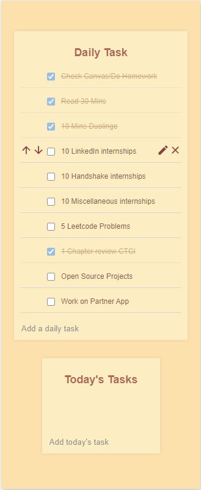

# Desktop Productivity To Do List



## Description

The **Desktop Productivity To Do List** is a simple desktop application built with JavaScript, React, and Electron that is designed to help you increase productivity and stay organized by constantly running in the background and reminding you of your daily tasks. Whether you're working on your computer or simply have it running in the background, this app will be there to assist you in managing your tasks efficiently.

## Features

- **Background Operation:** The app seamlessly runs in the background, ensuring it's always ready to assist you without interrupting your workflow.

- **Task Persistence:** Add and manage your daily tasks to be persistent whenever your computer restarts or shuts down.

- **Minimalistic UI:** The app features an intuitive and minimalistic user interface, making it easy to navigate and use.

- **Cross-Platform:** Built using Electron, the app is cross-platform, ensuring compatibility with Windows, macOS, and Linux.

## Installation

To get started with the to do list, follow these steps:

1. Clone the repository:

   ```bash
   git clone https://github.com/alexsio03/todolist.git

2. Install dependencies:

   ```bash
   cd todolist
   npm install

3. Run the app:
   ```bash
   npm start

## Usage

- Launch the app, and it will automatically start running in the background.

- Click on the app icon in your system tray to open the task management interface.

- Add your daily tasks, set reminders, and customize todays task as needed.

## Contributing

Contributions are welcome! If you have any ideas for improving the to do list or want to report a bug, please open an issue or submit a pull request. For major changes, please discuss your ideas in the [Discussions](https://github.com/alexsio03/todolist/discussions) section.

## License

This project is licensed under the MIT License - see the [LICENSE](LICENSE) file for details.

## Acknowledgments

The Desktop Productivity Assistant was created with love by [Alex Warda](https://github.com/alexsio03). Special thanks to the open-source community and the following libraries and frameworks that made this project possible:

- [Electron](https://www.electronjs.org/)
- [React](https://reactjs.org/)

If you find this project helpful, consider giving it a ⭐️ or sharing it with others!

